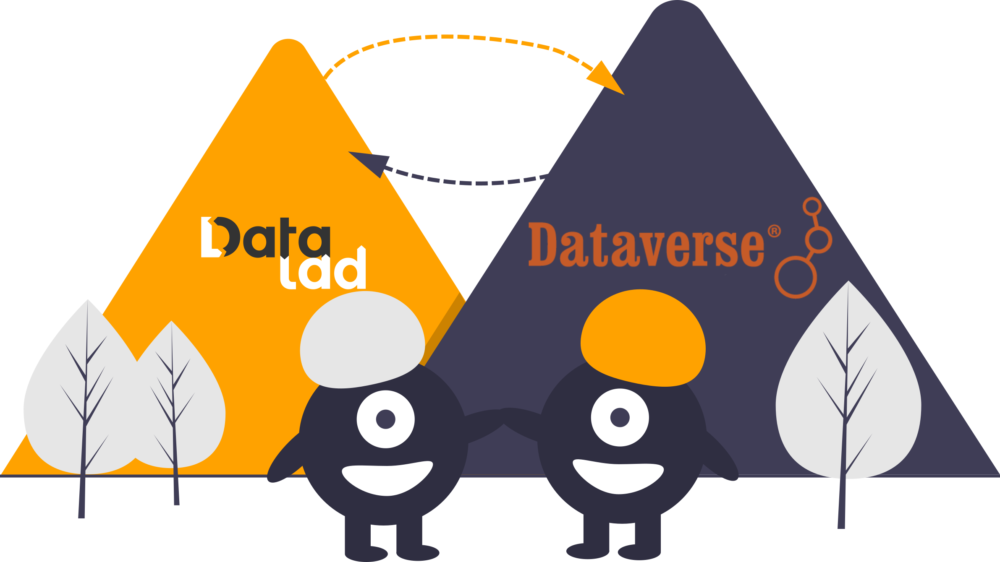

DataLad Dataverse
*****************

`Dataverse <https://dataverse.org>`__ is an open source research data
repository software that is deployed all over the world.  It supports sharing,
preserving, citing, exploring, and analyzing research data with descriptive
metadata, and thus contributes greatly to open, reproducible, and FAIR science.
`DataLad <http://datalad.org>`__, on the other hand, is a decentralized data
management solution built on `Git <https://git-scm.org>`__ and `git-annex
<https://git-annex.branchable.com>`__.  Its core data structure, a DataLad
dataset, can version control files of any size, and streamlines data transport,
updates, and collaboration.

This DataLad extension package provides interoperability with Dataverse for the
purpose of depositing DataLad dataset on Dataverse, and for retrieving DataLad
datasets from Dataverse instances, together with their full version history.

This software was originally created during `BrainHack 2022
<https://github.com/ohbm/hackathon2022/issues/43>`__, and is the result of a
wonderful collaboration between `many awesome people
<https://github.com/datalad/datalad-dataverse#contributors->`__.  If you want
to get in touch or contribute, please see our :ref:`contributing guidelines
<contribute>`.

Documentation overview
======================

.. toctree::
   :maxdepth: 1

   intro
   settingup
   tutorial
   contributing
   glossary

Commands and API
================

.. toctree::
   :maxdepth: 1

   cmdline
   modref

Acknowledgements
================

This DataLad extension was developed with support from the German Federal
Ministry of Education and Research (BMBF 01GQ1905), the US National Science
Foundation (NSF 1912266), the Helmholtz research center Jülich (RDM challenge
2022), and the Deutsche Forschungsgemeinschaft (DFG, German Research
Foundation) under grant `SFB 1451
<https://gepris.dfg.de/gepris/projekt/431549029>`__, INF project).
