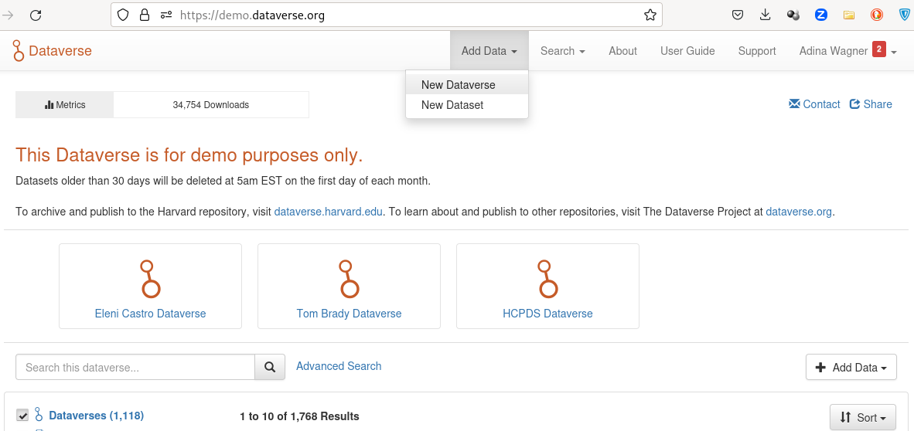
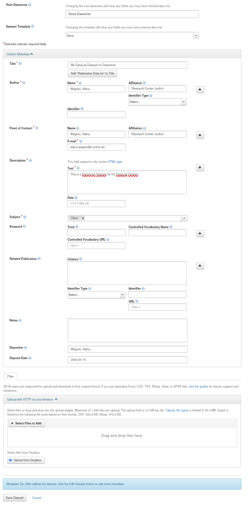
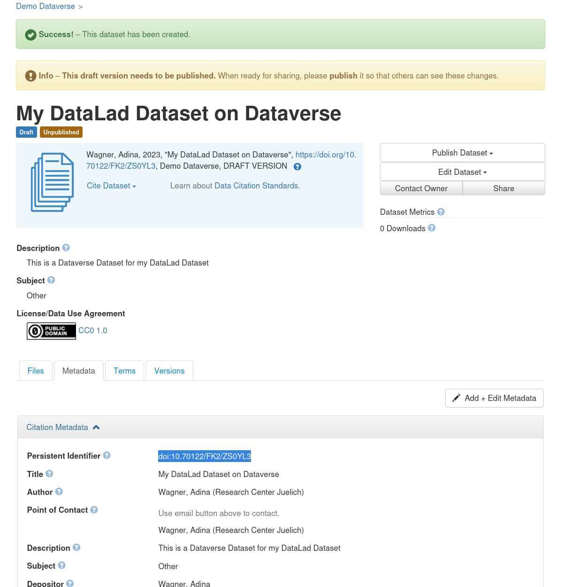
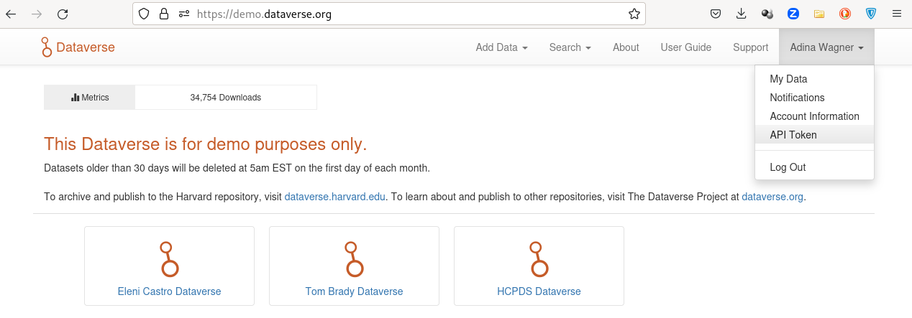
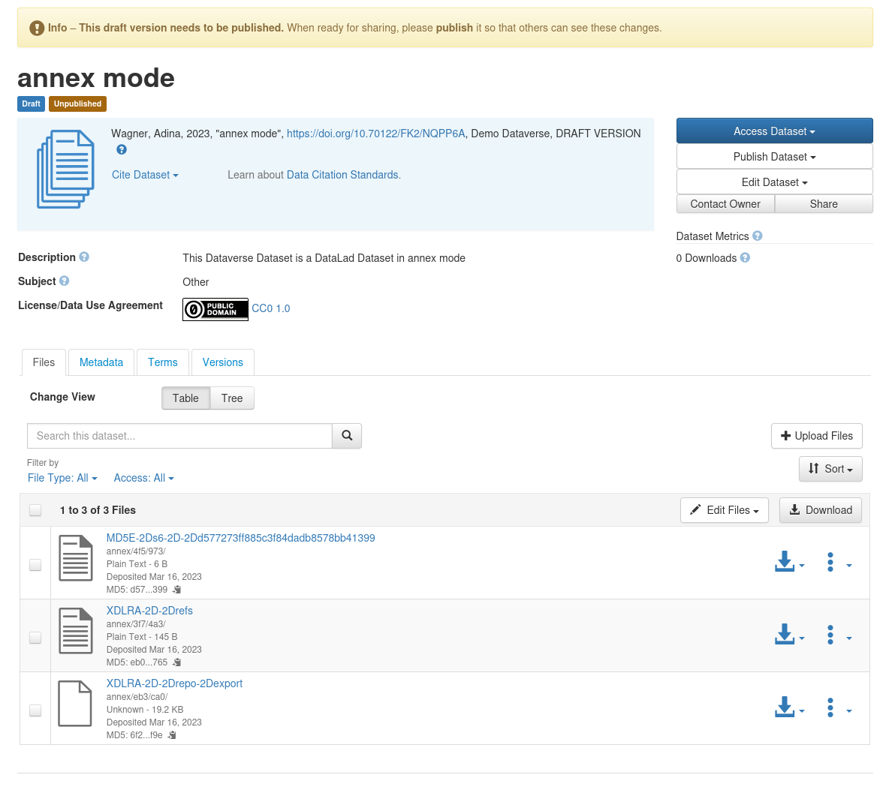
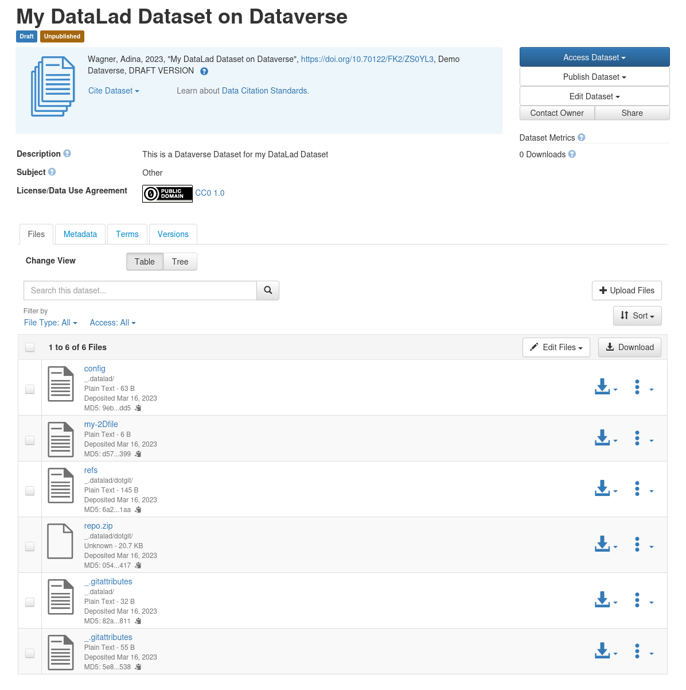
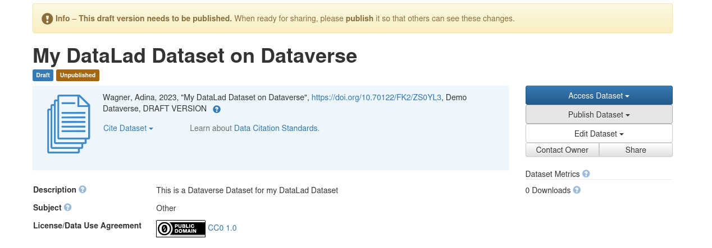

.. include:: ./links.inc

.. _tutorial:

Tutorial
========

The ``datalad-dataverse`` extension provides a single command, ``add-sibling-dataverse``.
This tutorial shows you how it can be used for interactions and publications to Dataverse.
For a high-level overview of what's possible with this extension, see also :ref:`usecases`.

A full Dataverse interaction requires 5 steps:

* :ref:`1`
* :ref:`2`
* :ref:`3`
* :ref:`4`
* :ref:`5`

.. _1:

1. Create a Dataverse dataset
^^^^^^^^^^^^^^^^^^^^^^^^^^^^^

If you want to **publish** a dataset to Dataverse, you will need a dedicated location on Dataverse that we will publish our dataset to.
For this, we will use a :term:`Dataverse dataset`.

Go to your favourite Dataverse instance, log in or create an account, and create a new draft :term:`Dataverse dataset` via the ``Add Data`` header:

The ``Add Dataset`` button takes you to a configurator for your :term:`Dataverse dataset`.
Provide all relevant details and metadata entries in the form.
Importantly, **don't** upload any of your data files - this will be done by DataLad once we ``datalad push`` later.

Once you have clicked ``Save Dataset``, you'll have a draft :term:`Dataverse dataset`.
It already has a DOI, and you can find it under the ``Metadata`` tab as "Persistent identifier":

Finally, make a note of the **URL** of your dataverse instance (e.g., ``https://demo.dataverse.org``), and the **DOI** of your draft dataset.
You will need this information for :ref:`step 3 <3>`.

.. _2:

2. Create a DataLad dataset
^^^^^^^^^^^^^^^^^^^^^^^^^^^

Next, you'll need a :term:`DataLad dataset` to push to your :term:`Dataverse dataset`.
If you already have one, skip this step.
If not, use ``datalad create <dataset-name-of-your-choice>`` to create a new dataset to populate, or transform an existing directory into a DataLad dataset using

.. code-block:: bash

   $ datalad create -d <path-to-directory> --force

In both cases, any files you add into the dataset can be saved using ``datalad save``.
If you have never done this before, its a good idea to give the first pages of the `DataLad handbook <http://handbook.datalad.org/r.html?install>`__ a quick read first.

Here's a toy example dataset with a single saved file:

.. code-block:: bash

   $ datalad create my-test-dataset
   create(ok): /tmp/my-test-dataset (dataset)
   $ cd my-test-dataset
   $ echo 12345 > my-file
   $ datalad save -m "Saving my first file"
   add(ok): my-file (file)
   save(ok): . (dataset)
   action summary:
      add (ok: 1)
      save (ok: 1)

.. _3:

3. Add a Dataverse sibling to your dataset
^^^^^^^^^^^^^^^^^^^^^^^^^^^^^^^^^^^^^^^^^^

Now that you have a draft :term:`Dataverse dataset` on Dataverse and a local :term:`DataLad dataset`, let them get to know each other using the ``datalad add-sibling-dataverse`` command.
This command registers the remote Dataverse Dataset as a known remote location to your Dataset and will allow you to publish the entire Dataset (Git history and annexed data) or parts of it to Dataverse.

If you run this command for the first time, you will need to provide an API Token to authenticate against the chosen Dataverse instance in an interactive prompt.
This is how this would look:

.. code-block:: bash

    $ datalad add-sibling-dataverse https://demo.dataverse.org doi:10.70122/FK2/NQPP6A
    A dataverse API token is required for access.
    Find it at https://demo.dataverse.org by clicking on your name at the top right corner and then clicking on API Token
    token:

You'll find this token if you follow the instructions in the prompt under your user account on your Dataverse instance, and you can copy-paste it into the command line:

If authentication with the token was successful, it will be saved into your
system's keyring.  If you have accounts on several different dataverse
instances or multiple users with different tokens, you can use and store
several tokens with the ``--credential`` parameter of the command.  For
example::

  datalad add-sibling-dataverse \
    --credential demo-dataverse \
    https://demo.dataverse.org doi:10.70122/FK2/NQPP6A

will search for a previously used credential ``demo-dataverse``, or prompt for
a token if it can't find one and save it after success.

The ``datalad add-sibling-dataverse`` command needs at least two pieces of information: The **URL** of your Dataverse instance, and a **persistent identifier** of the draft :term:`Dataverse dataset` created in :ref:`step 1 <1>`.
Depending on what you want to transfer to Dataverse, you also need to configure the command with the correct ``--mode``.
Two popular choices are ``annex`` and ``filetree``.
The former, which is also the default, will prepare the Dataverse dataset to contain both the Git revision history of your dataset as well as its annexed contents (if your Dataverse instance supports this, and your data doesn't exceed file size limits).
The latter will publish a single snapshot of your dataset ("as it currently is", without version history).
Let's illustrate the differences in detail:

annex mode
**********

``--mode annex`` is the command's default, and will be used when you don't explicitly provide the ``--mode`` parameter.
It will create a non-human readable representation of your :term:`DataLad dataset` on Dataverse that includes Git history and annexed data:

.. code-block:: bash

   $ datalad add-sibling-dataverse \
     https://demo.dataverse.org \
     doi:10.70122/FK2/NQPP6A \
     --mode annex
   add_sibling_dataverse.storage(ok): . [dataverse-storage: https://demo.dataverse.org (DOI: doi:10.70122/FK2/NQPP6A)]
   [INFO   ] Configure additional publication dependency on "dataverse-storage"
   add_sibling_dataverse(ok): . [dataverse: datalad-annex::?type=external&externaltype=dataverse&encryption=none&exporttree=no&url=https%3A//demo.dataverse.org&doi=doi:10.70122/FK2/NQPP6A (DOI: doi:10.70122/FK2/NQPP6A)]

As soon as you've created the sibling, you can push:

.. code-block:: bash

    $ datalad push --to dataverse
    copy(ok): my-file (file) [to dataverse-storage...]
    publish(ok): . (dataset) [refs/heads/master->dataverse:refs/heads/master [new branch]]
    publish(ok): . (dataset) [refs/heads/git-annex->dataverse:refs/heads/git-annex [new branch]]

    action summary:
       copy (ok: 1)
       publish (ok: 2)

And this is the result on Dataverse:

filetree mode
*************

``--mode filetree`` is an export mode, i.e., it will mirror a snapshot of the current state of your :term:`DataLad dataset` to Dataverse.
This is more human readable on Dataverse, but wouldn't include historical versions of your annexed files.
The Git history of your dataset is included in this mode, too.

.. code-block:: bash

   $ datalad add-sibling-dataverse \
     https://demo.dataverse.org \
     doi:10.70122/FK2/ZS0YL3 \
     --mode filetree
   add_sibling_dataverse.storage(ok): . [dataverse-storage: https://demo.dataverse.org (DOI: doi:10.70122/FK2/ZS0YL3)]
   [INFO   ] Configure additional publication dependency on "dataverse-storage"
   add_sibling_dataverse(ok): . [dataverse: datalad-annex::?type=external&externaltype=dataverse&encryption=none&exporttree=yes&url=https%3A//demo.dataverse.org&doi=doi:10.70122/FK2/ZS0YL3 (DOI: doi:10.70122/FK2/ZS0YL3)]

Now, you can push:

.. code-block:: bash

    $ datalad push --to dataverse
    copy(ok): .datalad/.gitattributes (dataset)
    copy(ok): .datalad/config (dataset)
    copy(ok): .gitattributes (dataset)
    copy(ok): my-file (dataset)
    publish(ok): . (dataset) [refs/heads/master->dataverse:refs/heads/master [new branch]]
    publish(ok): . (dataset) [refs/heads/git-annex->dataverse:refs/heads/git-annex [new branch]]
    action summary:
      copy (ok: 4)
      publish (ok: 2)

And this is the result on Dataverse:

Note that Dataverse has a number of file name requirements that restrict which characters can be used in file or directory names.
DataLad works around this by encoding file or directory names to comply to the allowed character set.
Therefore, your :term:`Dataverse dataset` might display files with slightly different names from what your local :term:`DataLad dataset` displays.
These names will be changed into their original form when the dataset is cloned, though.

.. _4:

4. Make your dataset public
^^^^^^^^^^^^^^^^^^^^^^^^^^^

Your dataset on Dataverse will be in draft mode after you've pushed content into it.
Use the webinterface to make it public and share it.

.. _5:

5. Clone a dataset from Dataverse
^^^^^^^^^^^^^^^^^^^^^^^^^^^^^^^^^

Finally, you or others can clone your datasets from Dataverse.
They'll need a special type of URL and the ``datalad clone`` command for this.

The URL required for cloning starts with ``datalad-annex::?`` and is provided to you by the ``datalad add-dataverse-sibling`` command.
Alternatively, you can also copy-paste it from the configuration of your remotes:

.. code-block:: bash

	$ git remote -v
	dataverse	datalad-annex::?type=external&externaltype=dataverse&encryption=none&exporttree=yes&url=https%3A//demo.dataverse.org&doi=doi:10.70122/FK2/ZS0YL3 (fetch)
	dataverse	datalad-annex::?type=external&externaltype=dataverse&encryption=none&exporttree=yes&url=https%3A//demo.dataverse.org&doi=doi:10.70122/FK2/ZS0YL3 (push)

Once you have this URL, anyone with an account on the Dataverse instance and the correct permissions for the dataset can clone it:

.. code-block:: bash

   $ datalad clone \
    'datalad-annex::?type=external&externaltype=dataverse&encryption=none&exporttree=no&url=https%3A//demo.dataverse.org&doi=doi:10.70122/FK2/NQPP6A' \
     my-clone
   [INFO   ] Remote origin uses a protocol not supported by git-annex; setting annex-ignore
   [INFO   ] access to 1 dataset sibling dataverse-storage not auto-enabled, enable with:
   | 		datalad siblings -d "/tmp/my-clone" enable -s dataverse-storage
   install(ok): /tmp/tmp/my-clone-of-annex-mode (dataset)

.. note::

   As a convenience it is also possible to use the URL of a Dataverse dataset landing
   page directly for ``clone``::

     datalad clone \
       https://demo.dataverse.org/dataset.xhtml?persistentId=doi:10.70122/FK2/IPNGCY

   Internally, it will be converted into the format shown above. This is
   intended to be used for one-off interactive cloning. For scripted access it
   is advisable to use the detailed format above, because changes in dataset
   layout and API are less likely to have an impact on this method, whereas the
   behavior of the convenience method may change in the future.

Afterwards, enable the special remote in the clone with the provided command, and retrieve file content using ``datalad get``:

.. code-block:: bash

   $ cd my-clone
   $ datalad siblings -d "/tmp/my-clone" enable -s dataverse-storage
    .: dataverse-storage(?) [git]
   $ datalad get my-file
   get(ok): my-file (file) [from dataverse-storage...]
